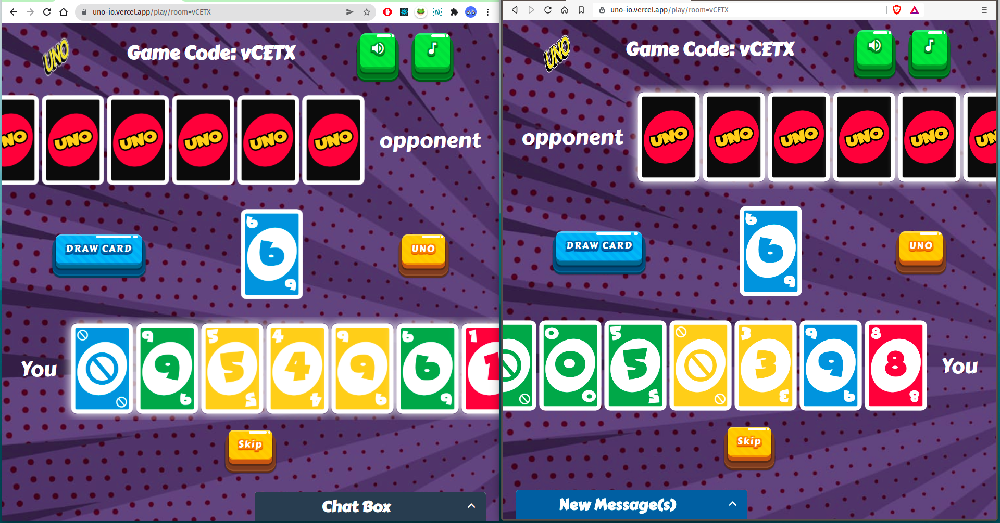

# [UNO-IO](https://uno-io.vercel.app/)

&nbsp;

&nbsp;
&nbsp;
## Overview 



- Play UNO card game online
- Chat with your friends in Real-time
- Beautiful and Responsive UI
- In-game Sounds to make it more enjoyable

## What is UNO-IO?

**UNO-IO is a web app which allows playing UNO card game online with your friends in real time.**

## Project setup 💻

```
> Cloning the repo
    >> git clone https://github.com/harshkc/UNO-IO.git
    >> cd UNO-IO
> Install all client dependencies from client directory
    >> cd client
    >> yarn install
> Install all server dependencies from server directory
    >> cd server
    >> yarn install   
> Start the server on localhost:5000
    >> cd server
    >> yarn start
> Setup the env variable in client directory
    >> cd client
    >> touch .env 
    >> copy the variable name from .env.example
    >> set the value to 'https://localhost:5000'
> Start the app on localhost:3000
    >> cd client
    >> yarn start

```
